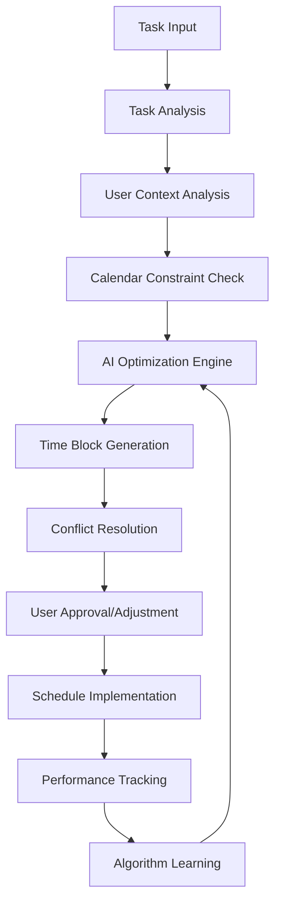
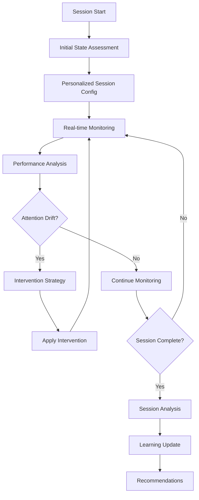

# NeuroForge: Smart Time Blocking & AI-Powered Focus Sessions Analysis

## Deep Dive: Smart Time Blocking System

### Core Concept
Smart time blocking leverages AI to automatically optimize calendar scheduling based on:
- User productivity patterns
- Task complexity analysis
- Energy level predictions
- Context switching minimization
- Priority matrix automation

### Technical Architecture

#### 1. Data Collection Layer
```
User Behavior Analytics:
├── Time tracking data (active/passive)
├── Task completion rates by time slots
├── Energy level self-reporting
├── Calendar interaction patterns
├── Device usage patterns
├── Biometric data (optional - heart rate, sleep)
└── Environmental factors (location, weather)
```

#### 2. AI Processing Engine
**Open-Source AI Solutions:**
- **Primary LLM:** Ollama (Local inference)
  - Models: Llama 3.1, Mistral 7B, CodeLlama
- **Vector Database:** ChromaDB or Weaviate
- **Time Series Analysis:** Prophet (Facebook's forecasting tool)
- **Pattern Recognition:** scikit-learn clustering algorithms

#### 3. Smart Time Blocking Input System

**Primary Inputs Required:**
1. **Task Information**
   - Task title and description
   - Estimated duration
   - Priority level (1-5 scale)
   - Deadline/due date
   - Task type/category
   - Required resources/tools
   - Energy requirement (low/medium/high)
   - Prerequisite tasks
   - Preferred time constraints

2. **User Preferences**
   - Work hours and availability
   - Break preferences
   - Deep work vs. shallow work ratios
   - Meeting tolerance levels
   - Buffer time requirements
   - Travel time considerations

3. **Historical Data**
   - Past task completion times
   - Productivity patterns by hour/day
   - Interruption frequency data
   - Task switching penalties
   - Success rates by time blocks

### Smart Time Blocking Algorithm Flow



### Implementation Components

#### 1. Task Complexity Analyzer
```python
# Pseudo-code for task complexity analysis
def analyze_task_complexity(task_description, historical_data):
    # Use NLP to extract task features
    features = extract_features(task_description)
    
    # Compare with historical similar tasks
    similar_tasks = find_similar_tasks(features, historical_data)
    
    # Predict duration and energy requirement
    complexity_score = ml_model.predict(features)
    
    return {
        'estimated_duration': duration,
        'energy_requirement': energy_level,
        'optimal_time_slots': time_preferences
    }
```

#### 2. Productivity Pattern Predictor
```python
def predict_productivity_windows(user_id, date_range):
    # Analyze historical productivity data
    productivity_data = get_user_productivity_history(user_id)
    
    # Use time series forecasting
    model = Prophet()
    model.fit(productivity_data)
    
    # Generate productivity forecast
    future_productivity = model.make_future_dataframe(periods=date_range)
    forecast = model.predict(future_productivity)
    
    return optimal_time_windows
```

---

## Deep Dive: AI-Powered Focus Sessions

### Core Concept
AI-powered focus sessions create personalized, adaptive work environments that:
- Dynamically adjust session parameters based on real-time performance
- Provide intelligent interruption management
- Offer contextual break recommendations
- Adapt to individual cognitive patterns

### Technical Architecture

#### 1. Real-Time Monitoring System
```
Focus Session Tracking:
├── Keystroke/mouse activity patterns
├── Application usage monitoring
├── Attention drift detection
├── Biometric feedback (optional)
├── Environmental noise levels
├── Screen time analysis
└── Break timing optimization
```

#### 2. AI-Powered Focus Engine
**Open-Source Solutions:**
- **Attention Modeling:** Custom transformer models (Hugging Face)
- **Behavioral Analysis:** TensorFlow/PyTorch models
- **Audio Processing:** Mozilla DeepSpeech (for voice commands)
- **Computer Vision:** OpenCV (for posture/attention tracking)

### AI-Powered Focus Sessions Input System

**User Inputs Required:**

1. **Session Configuration**
   - Session type (deep work, creative, admin, learning)
   - Target duration
   - Break preferences (Pomodoro, Ultradian, custom)
   - Distraction tolerance level
   - Background preferences (music, white noise, silence)
   - Goal/objective for the session

2. **Personal Optimization Settings**
   - Peak focus duration (personal maximum)
   - Preferred break activities
   - Attention restoration preferences
   - Motivation triggers
   - Stress response patterns
   - Learning style preferences

3. **Environmental Preferences**
   - Lighting preferences
   - Temperature comfort range
   - Noise level tolerance
   - Device restrictions during focus
   - Notification management rules

### AI Focus Session Algorithm



### Implementation Components

#### 1. Attention State Classifier
```python
def classify_attention_state(activity_data, biometric_data=None):
    # Feature extraction from multiple data sources
    features = {
        'keystroke_velocity': calculate_typing_speed(activity_data),
        'mouse_movement_patterns': analyze_mouse_behavior(activity_data),
        'application_switching': count_app_switches(activity_data),
        'idle_time_distribution': calculate_idle_patterns(activity_data)
    }
    
    if biometric_data:
        features.update({
            'heart_rate_variability': biometric_data['hrv'],
            'stress_indicators': biometric_data['stress_level']
        })
    
    # Use trained ML model to classify attention state
    attention_state = attention_classifier.predict(features)
    
    return {
        'focus_level': attention_state['focus_score'],
        'fatigue_level': attention_state['fatigue_score'],
        'distraction_risk': attention_state['distraction_probability']
    }
```

#### 2. Adaptive Intervention System
```python
def generate_intervention_strategy(attention_state, user_preferences, session_context):
    if attention_state['focus_level'] < 0.4:
        # Low focus - suggest micro-break or environment change
        interventions = [
            'micro_break_2min',
            'background_music_change',
            'lighting_adjustment',
            'breathing_exercise'
        ]
    elif attention_state['fatigue_level'] > 0.7:
        # High fatigue - suggest longer break
        interventions = [
            'rest_break_10min',
            'physical_movement',
            'hydration_reminder',
            'eye_rest_exercise'
        ]
    elif attention_state['distraction_risk'] > 0.6:
        # High distraction - increase environmental controls
        interventions = [
            'block_distracting_apps',
            'notification_silence',
            'focus_music_enhancement',
            'visual_focus_aid'
        ]
    
    # Select best intervention based on user preferences and context
    selected_intervention = optimize_intervention_selection(
        interventions, user_preferences, session_context
    )
    
    return selected_intervention
```

---

## User Settings & Customization Framework

### Smart Time Blocking Settings

**Automation Level Controls:**
- Full Auto: AI manages entire calendar
- Semi-Auto: AI suggests, user approves
- Manual Override: User can always modify

**Time Block Preferences:**
- Minimum/maximum block durations
- Buffer time requirements
- Meeting clustering preferences
- Deep work protection hours
- Flexible vs. fixed scheduling

**Learning Controls:**
- Data usage permissions
- Privacy settings for tracking
- Algorithm transparency levels
- Manual feedback mechanisms

### AI Focus Session Settings

**Personalization Controls:**
- Monitoring intensity levels
- Intervention frequency
- Break timing preferences
- Distraction management aggressiveness
- Biometric integration options

**Privacy & Control:**
- Data retention periods
- Tracking granularity controls
- Third-party integration permissions
- Offline mode availability

---

## Open-Source AI Integration Strategy

### Primary AI Stack
1. **Local LLM Server:** Ollama
   - Benefits: Privacy, no API costs, offline capability
   - Models: Llama 3.1 (general), CodeLlama (task analysis)

2. **Vector Database:** ChromaDB
   - Benefits: Semantic search, embeddings storage
   - Use case: Similar task matching, pattern recognition

3. **Time Series Forecasting:** Prophet
   - Benefits: Robust forecasting, handles seasonality
   - Use case: Productivity pattern prediction

4. **Machine Learning:** scikit-learn + PyTorch
   - Benefits: Comprehensive ML toolkit
   - Use case: Classification, clustering, neural networks

### API Integration Points
- Calendar APIs (Google Calendar, Outlook, CalDAV)
- Task management APIs (Todoist, Notion, local storage)
- Biometric device APIs (optional, with user consent)
- Environmental APIs (weather, location)

### Data Pipeline Architecture
```
Data Sources → Data Preprocessing → Feature Engineering → 
AI Models → Decision Engine → User Interface → 
Feedback Loop → Model Improvement
```

---

## Technical Implementation Roadmap

### Phase 1: Core Infrastructure
- Set up local AI server (Ollama)
- Implement basic time tracking
- Create user input system
- Build calendar integration

### Phase 2: Smart Time Blocking
- Develop task complexity analyzer
- Implement productivity pattern detection
- Create time block optimization algorithm
- Add user customization interface

### Phase 3: AI Focus Sessions
- Build attention monitoring system
- Implement real-time analysis engine
- Create intervention system
- Add biometric integration (optional)

### Phase 4: Advanced Features
- Cross-feature integration
- Advanced personalization
- Performance analytics dashboard
- Mobile app development

This framework provides a comprehensive foundation for implementing both smart time blocking and AI-powered focus sessions in NeuroForge, using entirely open-source AI solutions while maintaining user privacy and control.
